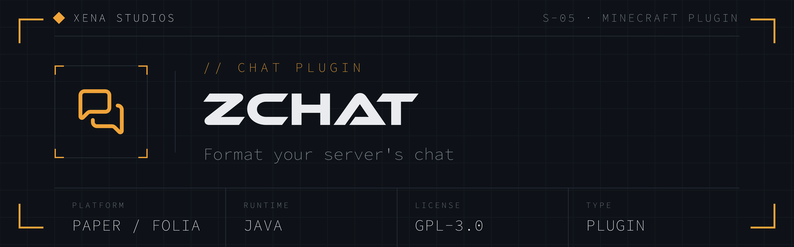

A **lightweight, high-performance chat plugin** for **Paper** (and Folia) networks.
zChat handles the chat essentials almost every server wants — **group-based message
formatting**, a **word/pattern filter**, a **per-player cooldown**, a **global chat
mute**, **chat clearing**, and a **per-player chat toggle** — each individually
toggleable, permissioned, and with fully customizable MiniMessage text.

Because it runs on **every chat message**, that path is built to be cheap: group formats
are pre-parsed, filter patterns are pre-compiled, all runtime state is lock-free, and the
message renderer runs once per message (not once per viewer). No always-on tick work, a
tiny memory footprint, and clean, fail-safe startup/reload.

zChat is built to **stay up**: every code path fails safe. It never throws out of
enable/reload, never blocks the main thread, and never disables itself on a bad config
value. A malformed format template falls back to a plain rendering rather than dropping a
message.

> **v2.** This is a from-scratch rewrite of the archived
> [zChat v1](https://github.com/mrzcookie/zchat) — now **GPLv3-only**, faster, lighter,
> Folia-ready, and dependency-free (no hard LuckPerms requirement).

---

## Features

- **Group chat formatting** — each message is rendered with the highest-`weight` group
  the sender has permission for (`zchat.group.<name>`), falling back to `default-format`.
  Formats are MiniMessage with `<player>`, `<displayname>`, `<message>` and optional
  PlaceholderAPI `%…%` placeholders. Player text is inserted as a component (never
  re-parsed), so players can't inject markup — and even with the optional colour
  permission only colour/decoration tags are honoured (never `<click>`/`<hover>`).
- **PlaceholderAPI (optional)** — `%…%` placeholders in formats expand when
  PlaceholderAPI is installed, and are ignored when it isn't. No hard dependency.
- **Chat filter** — block or censor configurable words / regex patterns (case-insensitive,
  pre-compiled). `block` cancels the message; `censor` masks each match with a configurable
  character. Bypass with `zchat.bypass.filter`.
- **Chat cooldown** — a per-player minimum delay between messages. Bypass with
  `zchat.bypass.cooldown`.
- **`/mutechat`** — toggle a global chat mute; only `zchat.bypass.mute` holders can talk
  while muted.
- **`/clearchat`** — flood the chat with blank lines to clear it for everyone;
  `zchat.bypass.clearchat` holders keep their view.
- **`/togglechat`** — let a player hide/show chat for themselves (they simply stop
  receiving others' messages).
- **`/zchat reload` / `info`** — reload re-reads and re-validates config and re-applies all
  message/behaviour values live; `info` shows build/version + runtime status.
- **Fully configurable** — per-feature `enabled`, per-command `aliases`/`permission`, and
  MiniMessage text throughout, plus a shared `messages.error.*` block. Safe defaults on;
  bad values fall back with a warning.
- **Folia-ready** — the same jar runs on Paper, Purpur and Folia; all runtime state is
  thread-safe and every player mutation runs on the correct scheduler.

---

## Requirements

- **Paper (or a fork like Purpur, or Folia) 1.20.6 or newer.** zChat compiles against the
  Paper 1.20.6 API — the first release where the modern Brigadier command API
  (`io.papermc.paper.command.brigadier`, `LifecycleEvents.COMMANDS`) is stable and
  non-experimental, and which bundles the modern `AsyncChatEvent` + `ChatRenderer` API.
  **The version target has no runtime performance impact** — it only gates which APIs
  compile, and a jar built against 1.20.6 runs unchanged on all newer versions.
- **Java 21 runtime.** The jar is compiled to Java 21 bytecode, so the server must run on
  Java 21+ (standard on modern networks).
- **No hard dependencies.** Groups resolve by permission node, so any permissions plugin
  (LuckPerms, etc.) works — none is required. **PlaceholderAPI** is an optional soft
  dependency: install it to use `%…%` placeholders in formats.

---

## Install

1. Grab a jar (see **Downloads** below) and drop it in your server's `plugins/` folder.
2. Start the server once — zChat writes a default `config.yml`.
3. Edit `plugins/zChat/config.yml` to taste, then run `/zchat reload`. Messages and
   behaviour values apply live; **enabling/disabling a command and changing its aliases
   are restart-only** (they apply when commands are registered at startup).
4. Grant permissions in your permission plugin as needed (see **Commands & permissions**),
   including the `zchat.group.*` nodes that select each rank's chat format.

### Downloads

- **Stable releases:** https://github.com/xena-studios/zchat/releases/latest —
  semantic-version releases (`vMAJOR.MINOR.PATCH`) cut from git tags. Also published to
  [Modrinth](https://modrinth.com/plugin/zchat) on each release.
- **Nightly builds:** the rolling [`nightly`](https://github.com/xena-studios/zchat/releases/tag/nightly)
  pre-release always carries `zChat-nightly.jar`, the freshest build of `main`.
  Pre-release — handy for testing, not for production.
- **Per-commit builds:** every push and PR uploads the jar as a workflow artifact under
  the repository's **Actions** tab.

Versioning is semantic and derived from git tags. A tagged commit builds to a clean
version (e.g. `2.0.0`); any commit after the latest tag builds to a nightly pre-release
identity (`<version>-nightly.<n>+<short-sha>`). The exact identity lives in
`paper-plugin.yml`, `build-info.properties` and `/zchat info`.

---

## Configuration reference

Full, commented defaults live in [`src/main/resources/config.yml`](src/main/resources/config.yml).
`config-version` is managed by the plugin — on upgrade, new keys are merged in without
wiping your settings. Invalid values fall back to their default with a console warning;
the plugin never disables itself over config. Leaving a permission blank (`""`) means
**no restriction**.

### Formatting (`formatting`)

| Key | Default | Description |
| --- | --- | --- |
| `enabled` | `true` | Master switch for group formatting. |
| `color-permission` | `zchat.chat.color` | Holders may use MiniMessage tags in their own messages (blank = never). |
| `default-format` | *(set)* | Fallback format when no group matches. |
| `groups.<name>.weight` | `0` | Higher weight wins when a player matches several groups. |
| `groups.<name>.permission` | *(set)* | Node that selects this format (blank = applies to everyone). |
| `groups.<name>.format` | *(set)* | MiniMessage template; `<player>`, `<displayname>`, `<message>`, `%papi%`. |

Ships `vip`, `staff`, `admin` groups — edit, delete, or add your own. A player matching
**no** group uses `default-format`; leave `groups` empty to format everyone with it.

### Filter (`filter`)

| Key | Default | Description |
| --- | --- | --- |
| `enabled` | `true` | Master switch. |
| `mode` | `censor` | `block` (cancel + warn) or `censor` (mask matches). |
| `censor-char` | `*` | Character each match is masked with (censor mode). |
| `patterns` | *(list)* | Case-insensitive Java regex entries. |
| `message-blocked` | *(set)* | Sent to the sender when a message is blocked. |

### Cooldown (`cooldown`)

| Key | Default | Description |
| --- | --- | --- |
| `enabled` | `true` | Master switch. |
| `seconds` | `3` | Minimum delay between a player's messages. |
| `message` | *(set)* | Sent when rate-limited; supports `<seconds>`. |

### Commands (`clearchat` / `mutechat` / `togglechat`)

Each shares `enabled`, `aliases` and `permission`, plus its own messages:

| Command | Default aliases | Extra keys |
| --- | --- | --- |
| `clearchat` | `cc` | `lines` (100), `message-cleared` (`<player>`) |
| `mutechat` | `mc` | `message-muted`/`-unmuted` (`<player>`), `message-blocked` |
| `togglechat` | `tc` | `message-on`, `message-off` |

---

## Commands & permissions

| Command | Permission | Default | Description |
| --- | --- | --- | --- |
| `/clearchat` (+ `cc`) | `zchat.command.clearchat` | op | Clear the chat for everyone. |
| `/mutechat` (+ `mc`) | `zchat.command.mutechat` | op | Toggle the global chat mute. |
| `/togglechat` (+ `tc`) | `zchat.command.togglechat` | **everyone** | Hide/show chat for yourself. |
| `/zchat reload` / `info` (+ `zc`) | `zchat.admin` | op | Reload config / show status. |

| Bypass / group node | Default | Grants |
| --- | --- | --- |
| `zchat.bypass.mute` | op | Speak while chat is muted. |
| `zchat.bypass.cooldown` | op | Ignore the chat cooldown. |
| `zchat.bypass.filter` | op | Ignore the chat filter. |
| `zchat.bypass.clearchat` | op | Keep your chat on `/clearchat`. |
| `zchat.chat.color` | op | Use MiniMessage colours in your own messages (colour/decoration tags only). |
| `zchat.group.vip` / `.staff` / `.admin` | op | Apply that group's chat format. |

All permissions are declared in `paper-plugin.yml` with these defaults so the plugin is
safe out-of-the-box. Custom permissions set in config that aren't declared default to
op-only; set them blank (`""`) for no restriction.

---

## How it stays fast & lightweight

- **A disciplined hot path.** The chat listener reads only the immutable settings snapshot
  and lock-free runtime state — no `getConfig()`, no static-text MiniMessage parse, no
  regex compile per message. Gates run cheapest-first (mute → cooldown → filter → format
  → viewer hiding).
- **Parse/compile once.** Group formats are pre-validated and parsed per message only for
  their placeholders; filter patterns are compiled at load; the chat renderer is
  viewer-unaware (rendered once, not per recipient).
- **No always-on work.** zChat schedules no repeating tasks. The only listener is the chat
  pipeline itself; per-player state is dropped on quit so nothing leaks.
- **Immutable settings snapshot.** Config is parsed once into an immutable object and
  swapped atomically on `/zchat reload`; runtime state (mute/toggle/cooldowns) is
  preserved across the swap.
- **Thread-correct + Folia-aware.** All runtime state is concurrent; player mutations run
  on the correct scheduler. One jar, correct on Paper, Purpur and Folia.
- **Fail-safe everywhere.** `onEnable`/`reload` and every command registration are wrapped
  so a bad value or one broken command is logged and skipped, never taking the server down.

---

## Building

```bash
./gradlew build
```

Produces the shaded, runnable jar at `build/libs/zChat-<version>.jar` (the version is
derived from git tags — see **Downloads**). Requires a JDK 21 toolchain (Gradle will
provision or use one). Unit tests cover the filter match/censor logic and the runtime
chat-state (cooldown/toggle/mute) (`./gradlew test`).

### Releasing

Push a semantic-version tag to cut a release:

```bash
git tag v2.0.0 && git push origin v2.0.0
```

The **Release** workflow builds the tagged commit, publishes a GitHub release with the
jar, and uploads it to Modrinth. Modrinth publishing needs two repository settings (the
step skips cleanly if they're absent):

- **`MODRINTH_TOKEN`** — a repository *secret* holding a Modrinth API token.
- **`MODRINTH_PROJECT_ID`** — a repository *variable* with the Modrinth project id/slug.

Optional variables `MODRINTH_GAME_VERSIONS` (default `1.20.6`) and `MODRINTH_LOADERS`
(default `paper,folia,purpur`) override the published game versions and loaders
(comma-separated).

---

## License

[GNU General Public License v3.0 only](LICENSE).
